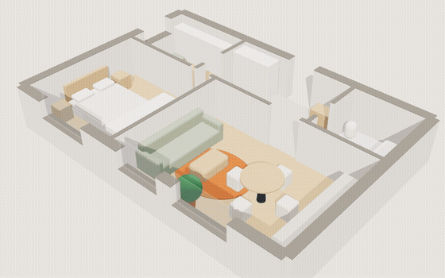
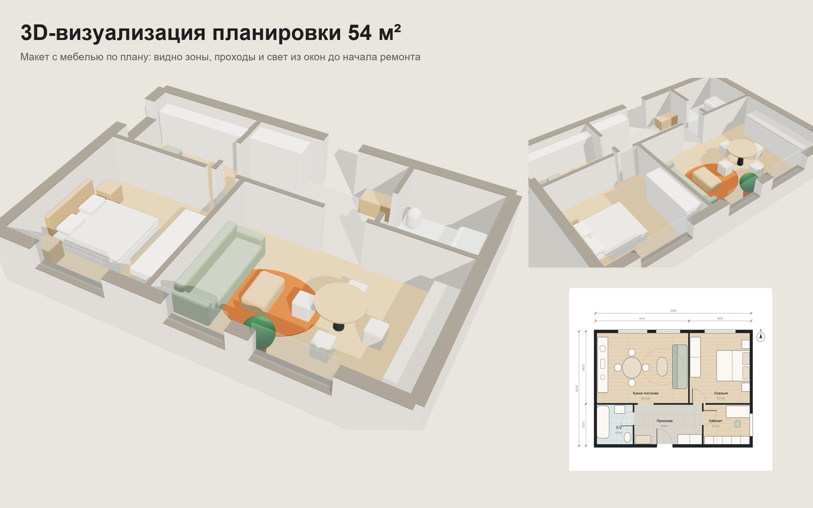
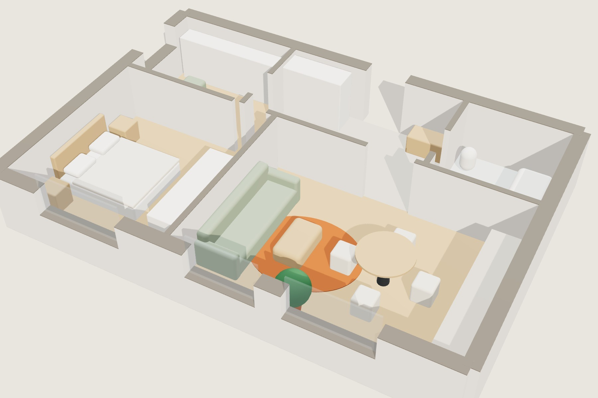
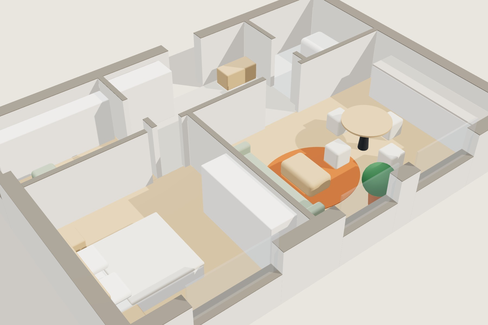
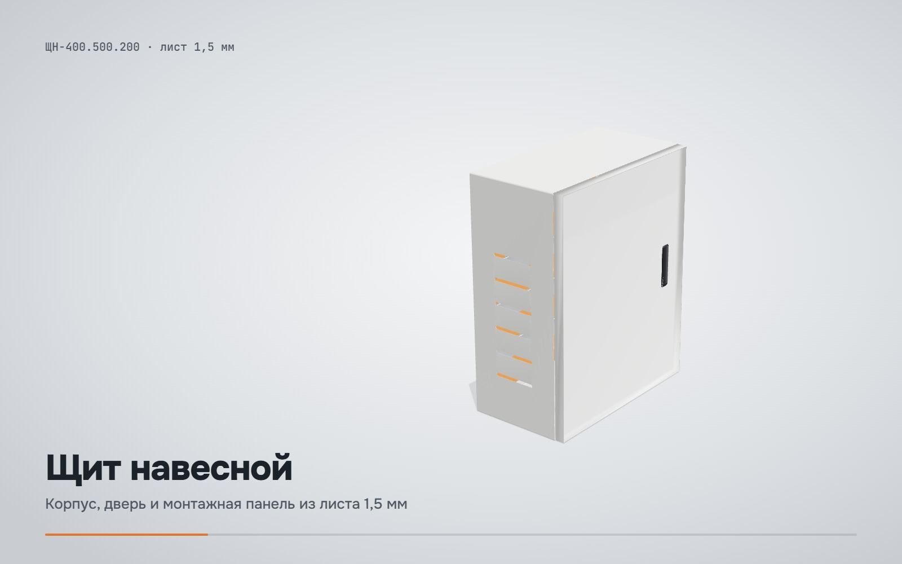
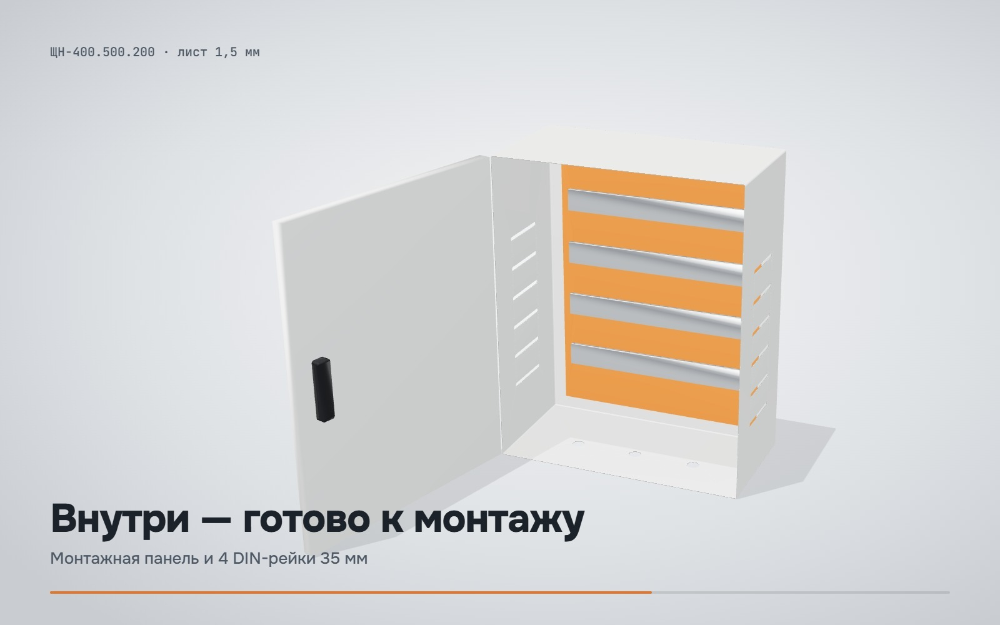
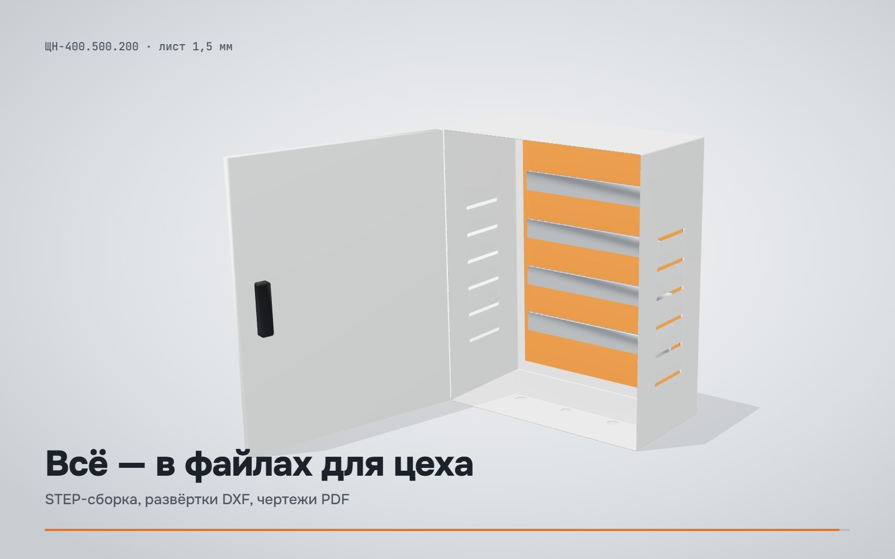
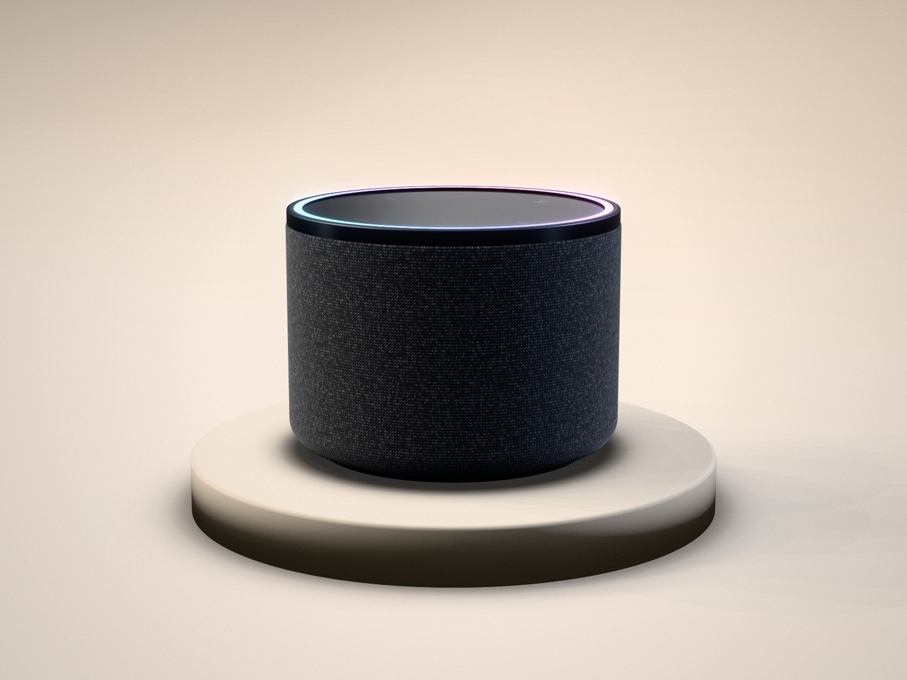
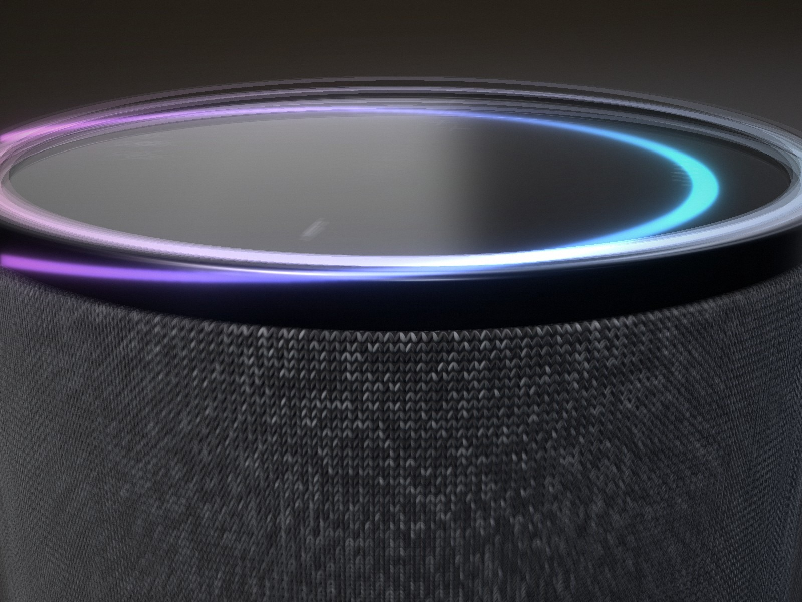

# threejs-viz

3D в реальном времени для веба на чистом Three.js: анимации товаров и прогулки по
интерьерам, которые открываются во вкладке браузера, и headless-рекордер, который превращает
их в MP4 для соцсетей.



## apartment-3d

Глиняная 3D-модель квартиры 54 м², построенная по планировке: стены срезаны на уровне глаз,
мебель блоками, мягкие тени и орбитальная камера. Та же сцена рендерит кадры для
презентации клиенту.

| | | |
|---|---|---|
|  |  |  |

## product-animation

Электрошкаф из [cad-engineering](https://github.com/YoungOver/cad-engineering): открывание
двери, появление компонентов и пролёты камеры по таймлайну, светлая и тёмная версии.

| | | |
|---|---|---|
|  |  |  |

## tools/recorder.mjs

Детерминированная запись кадров: открывает страницу в headless Chrome, ведёт часы анимации
кадр за кадром через `window.renderAt(t)` и отдаёт кадры в ffmpeg. Ни одного пропущенного
кадра, как бы медленно ни работала машина.

```bash
node tools/recorder.mjs apartment-3d orbit.html orbit.mp4 12 1080 1080
```

## CGI

Рендеры товаров из того же конвейера:

| | |
|---|---|
|  |  |
